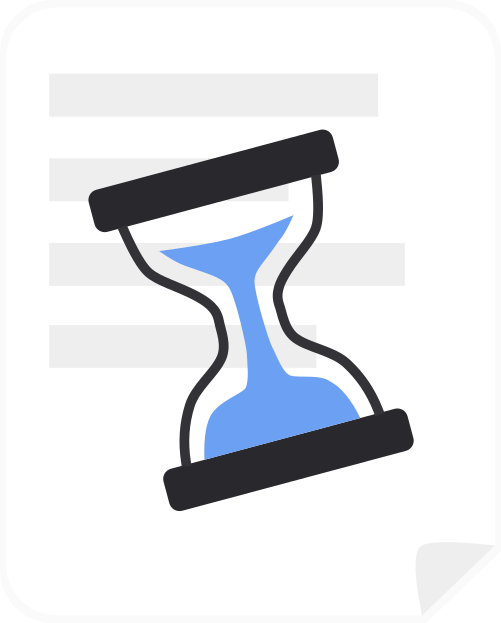

<div align="center">
    
    <h1>Chronos</h1>
    <p>A simple, fast and lightweight documentation server written in Go.</p>
    <hr />
</div>

## Features

- API based response
- Markdown support
- Search
- Localization
- Git based and/or local articles storage
- Ristretto based cache (more cache backends coming soon)
- Multi-repository support

## Configuration

Edit the `config/chronos.json` file to configure the server.

## Run (dev)

```bash
go run main.go
```

## Build

```bash
go build -o chronos main.go
```

## Run (prod)

```bash
./chronos
```

## Repositories

Chronos supports multiple repositories, both local and Git based. This allows you
to have a single server for multiple projects or multiple repositories for a single project.

Repositories can be configured in the `chronos.json` file as follows:

```json
{
  "port": "8080",
  "gitRepos": [
    {
      "id": "vosDocs",
      "url": "https://github.com/Vanilla-OS/documentation"
    },
    {
      "id": "vosVib",
      "url": "https://github.com/Vanilla-OS/vib",
      "rootPath": "docs/articles"
    }
  ],
  "localRepos": [
    {
      "id": "myAwesomeProject",
      "path": "/myAwesomeProject/documentation"
    }
  ]
}
```

Each repository must have a unique `id`, Chronos requires it to identify the repository
when requesting articles.

### Local repositories

Each local repository must contain an `articles` folder with the following structure:

```txt
documentation
├──articles
├─── en
│    └─── article1.md
└─── it
     └─── article1.md
```

### Git repositories

You can use a Git repositories as well, just add them to the `GitRepos` array in the `chronos.json` file,
Chronos will automatically clone them and update on each restart.

## Background updates

In the current version, automatic updates are in experimental stage and are not yet fully implemented.

## Article Structure

Each article must have a specific structure, here's an example:

```markdown
---
Title: My Awesome Article
Description: This is a test article written in English.
PublicationDate: 2024-02-16
Authors: [johnDoe]
Tags: [tag1, tag2]
---

# My Awesome Article

This is a test article written in English.
```

The article must start with a YAML header, followed by the article body.

## API Reference

### Get Status

Get the status of the server.

- **URL**: `http://localhost:8080/`
- **Method**: GET
- **Response**:

```json
{
  "status": "ok"
}
```

Check if a repository is available.

- **URL**: `http://localhost:8080/{repoId}`
- **Method**: GET
- **Response**:

```json
{
  "status": "ok"
}
```

### Get Repos

Get a list of available repositories.

- **URL**: `http://localhost:8080/repos`
- **Method**: GET
- **Response**:

```json

  {
    "Id": "remote1",
    "Count": 52,
    "Languages": [
      "bn",
      "de",
      "en",
      "es",
      "fr",
      "pl",
      "ta",
      "th",
      "uk"
    ],
    "FallbackLang": "",
    "FallbackEnabled": false
  },
  {
    "Id": "remote2",
    "Count": 8,
    "Languages": [
      "en"
    ],
    "FallbackLang": "",
    "FallbackEnabled": false
  },
  {
    "Id": "remote3",
    "Count": 1,
    "Languages": [
      "en"
    ],
    "FallbackLang": "",
    "FallbackEnabled": true
  }
]
```

### Get Articles

Get a list of articles, grouped by language.

- **URL**: `http://localhost:8080/{repoId}/articles/{lang}`
- **Method**: GET
- **Response**:

```json
{
  "title": "repoId",
  "SupportedLang": ["en", "it"],
  "tags": ["tag1", "tag2"],
  "articles": {
    "en": {
      "articles_repo/articles/en/test.md": {
        "Title": "Test Article",
        "Description": "This is a test article written in English.",
        "PublicationDate": "2023-06-10",
        "Authors": ["mirkobrombin"],
        "Tags": ["tag1", "tag2"],
        "Body": "..."
      }
    },
    "it": {
      "articles_repo/articles/it/test.md": {
        "Title": "Articolo di Test",
        "Description": "Questo è un articolo di test scritto in italiano.",
        "PublicationDate": "2023-06-10",
        "Authors": ["mirkobrombin"],
        "Tags": ["tag2"],
        "Body": "..."
      }
    }
  }
}
```

### Get Supported Languages

Get a list of supported languages.

- **URL**: `http://localhost:8080/{repoId}/langs`
- **Method**: GET
- **Response**:

```json
{
  "SupportedLang": ["en", "it"]
}
```

### Get Article by Language and Slug

Get a specific article by providing its language and slug.

- **URL**: `http://localhost:8080/{repoId}/articles/en/test`
- **Method**: GET
- **Response**:

```json
{
  "Title": "Test Article",
  "Description": "This is a test article written in English.",
  "PublicationDate": "2023-06-10",
  "Authors": ["mirkobrombin"],
  "Body": "..."
}
```

### Search Articles

Search articles based on a query string.

- **URL**: `http://localhost:8080/{repoId}/search/{lang}?q=test`
- **Method**: GET
- **Response**:

```json
[
  {
    "Title": "Test Article",
    "Description": "This is a test article written in English.",
    "PublicationDate": "2023-06-10",
    "Authors": ["mirkobrombin"],
    "Body": "..."
  }
]
```

## Use of Generative AI

Maintainers may use generative AI tools as assistants while working on Chronos. Non-trivial assisted commits disclose the tool, model, and scope of the work.

AI tools may assist with code comments, documentation, repetitive code, and issue triage. Maintainers make project decisions and review every assisted change before it is merged.

Use these trailers for non-trivial assisted commits:

```plain
Assisted-by: <tool>:<model-version>
AI-Scope: <what the tool generated and the prompt or a short prompt summary>
```

Single-line completions, renames, and formatting changes do not need trailers.

Coding agents must also follow [AGENTS.md](AGENTS.md) before changing files,
creating commits, or opening pull requests.
